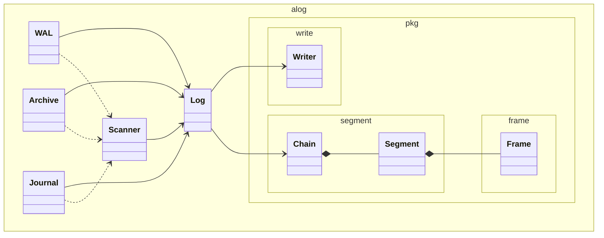

# Components

```mermaid
classDiagram
    namespace alog {
        class WAL
        class Archive
        class Journal
        class Log
        class Scanner
    }

    namespace alog.pkg.write {
        class Writer
    }

    namespace alog.pkg.segment {
        class Chain
        class Segment
    }

    namespace alog.pkg.frame {
        class Frame
    }

    WAL --> Log
    Archive --> Log
    Journal --> Log
    WAL ..> Scanner
    Archive ..> Scanner
    Journal ..> Scanner

    Scanner --> Log
    Log --> Writer
    Log --> Chain
    Chain *-- Segment
    Segment *-- Frame
```

